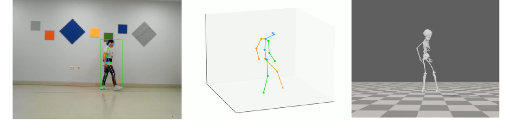
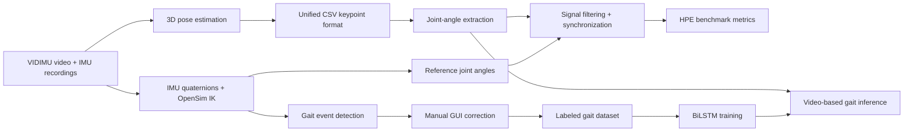
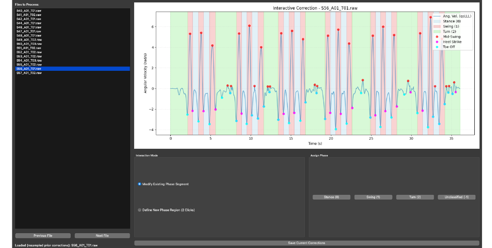
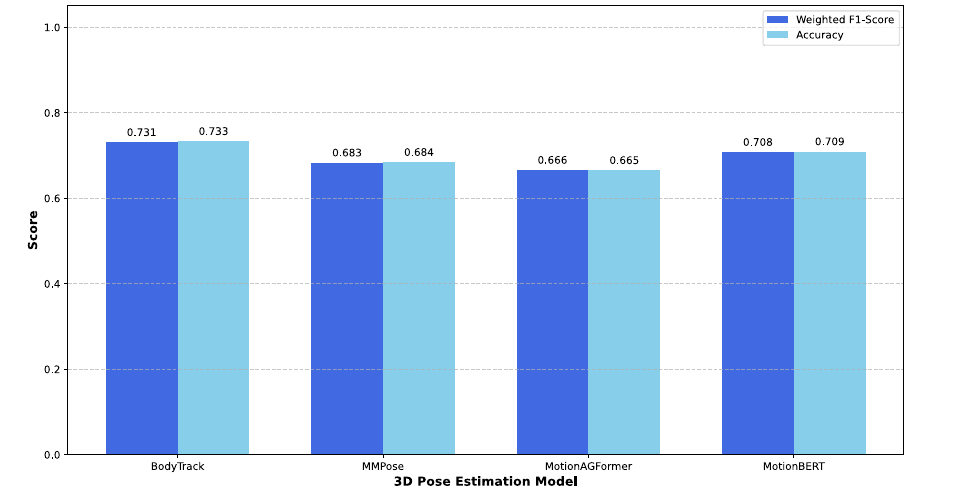

# Human Pose Estimation and Gait Segmentation

This repository contains the code developed for a computer-vision and biomechanics project focused on one question:

> Can monocular video and deep learning provide a practical, low-cost alternative to wearable inertial sensors for human movement analysis?

The project evaluates several 3D Human Pose Estimation (HPE) pipelines against IMU-based reference measurements, then uses the resulting joint-angle time series to train a recurrent neural network that segments gait into biomechanical phases.

The work has two connected parts:

1. **3D pose benchmark:** compare video-based pose estimators against IMU-derived joint angles.
2. **Gait phase segmentation:** train a BiLSTM model to classify each time instant as `Stance`, `Swing`, or `Turn`.



## Why this matters

Quantitative gait and movement analysis is useful in rehabilitation, clinical monitoring, sports science, and human-motion research. Traditional motion-capture systems are accurate, but they are expensive, intrusive, and usually require a specialized lab.

This project explores a more accessible workflow:

- capture movement with a normal monocular camera,
- estimate 3D body keypoints with deep learning,
- convert keypoints into joint-angle signals,
- validate those signals against IMU and OpenSim references,
- use the temporal patterns to segment gait automatically.

The result is a complete research pipeline for turning raw video and IMU recordings into comparable kinematic signals, benchmark metrics, corrected labels, trained models, and final gait-phase predictions.

## Pipeline



## What the project does

### 1. Converts heterogeneous HPE outputs into one format

The benchmark compares multiple 3D pose-estimation systems:

- **MotionAGFormer**
- **MotionBERT**
- **MMPose / VideoPose3D-style lifting**
- **NVIDIA BodyTrack**

Each tool exports pose data differently, so the scripts in `benchmark/` normalize the outputs into a shared CSV format with frame-level 3D joint coordinates.

### 2. Computes joint angles from video keypoints

The benchmark utilities compute biomechanical angles from 3D keypoints, including:

- left and right knee angle,
- left and right elbow flexion,
- left and right arm flexion.

The same angle extraction logic is applied to every HPE model so the comparison is fair.

### 3. Builds the IMU reference signal

The IMU data is processed from `.raw`, `.sto`, and `.mot` files. The `.mot` files contain OpenSim inverse-kinematics joint angles and are treated as the reference for the HPE benchmark.

The signal-processing flow includes:

- quaternion handling,
- filtering,
- downsampling from 50 Hz to 30 Hz where needed,
- interpolation of missing video values,
- moving-average smoothing,
- temporal alignment by minimizing RMSE.

### 4. Benchmarks HPE models against IMUs

The benchmark evaluates each model with:

- RMSE,
- MAE,
- normalized RMSE,
- Pearson correlation,
- R2,
- per-subject and per-activity plots.

Global benchmark results from the final report:

| Model | RMSE (deg) | MAE (deg) | Pearson r | R2 |
| --- | ---: | ---: | ---: | ---: |
| BodyTrack | 10.89 +/- 3.67 | 9.00 +/- 3.12 | 0.78 +/- 0.12 | 0.44 +/- 0.31 |
| MMPose | 11.04 +/- 4.17 | 9.35 +/- 3.61 | 0.84 +/- 0.10 | 0.58 +/- 0.26 |
| MotionAGFormer | **9.27 +/- 4.80** | **7.86 +/- 4.18** | **0.86 +/- 0.15** | **0.67 +/- 0.28** |
| MotionBERT | 12.28 +/- 4.59 | 10.15 +/- 3.86 | 0.79 +/- 0.11 | 0.16 +/- 0.50 |

MotionAGFormer produced the best global geometric agreement with the IMU reference, although performance varied by movement type and body segment.

### 5. Generates and corrects gait labels

The gait-segmentation dataset is created from the walking activity. The pipeline derives angular velocity from tibial IMU quaternions, detects gait events, and assigns initial phase labels.

Detected events include:

- mid-swing,
- heel strike,
- toe off.

Because automatic event detection is not perfect, the project includes a Python GUI for manual review and correction of gait labels.



The corrected training files contain:

| Column | Meaning |
| --- | --- |
| `time` | timestamp in seconds |
| `knee_angle_l` | left knee angle |
| `knee_angle_r` | right knee angle |
| `phase` | gait label: `0 = Stance`, `1 = Swing`, `2 = Turn`, `-1 = Unclassified` |

### 6. Trains a BiLSTM gait-segmentation model

The final segmentation model is a bidirectional LSTM that predicts a gait phase for each time step in a sequence.

Key modeling choices:

- input features: left and right knee angles,
- sequence length: 75 samples for the 50 Hz model,
- subject-wise GroupKFold validation,
- standard scaling fit only on training data,
- weighted cross-entropy to reduce class-imbalance bias,
- AdamW optimizer,
- early stopping on weighted F1-score,
- Optuna hyperparameter tuning.

The repository also includes an experimental `BiLSTM-CNN/` branch of the model, but the simpler BiLSTM was selected because it generalized better with the available dataset size.

### 7. Tests gait segmentation on video-derived angles

A second model track adapts the pipeline to 30 Hz video-derived joint angles. This makes it possible to evaluate how well gait segmentation works when the input comes from each HPE system instead of the IMU reference.



Global gait-segmentation results on video-derived angles:

| HPE input | Accuracy | Precision | Recall | Weighted F1 |
| --- | ---: | ---: | ---: | ---: |
| MotionAGFormer | 0.6651 | 0.6668 | 0.6651 | 0.6657 |
| MotionBERT | 0.7091 | 0.7091 | 0.7091 | 0.7076 |
| MMPose | 0.6841 | 0.6851 | 0.6841 | 0.6829 |
| BodyTrack | **0.7331** | **0.7329** | **0.7331** | **0.7306** |

One important finding is that the best model for geometric joint-angle accuracy was not necessarily the best input for gait segmentation. MotionAGFormer achieved the best global HPE benchmark metrics, while BodyTrack produced the best downstream gait-phase segmentation results. This suggests that temporal smoothness and signal consistency can matter as much as absolute per-frame angle error for recurrent models.

## Repository map

| Path | Purpose |
| --- | --- |
| `benchmark/` | Conversion scripts, joint-angle processing, HPE benchmarking notebooks, and evaluation workflows. |
| `benchmark_utils/` | Shared utilities for signal processing, synchronization, file loading, plotting, and metric calculation. |
| `video/` | Notebooks and helper workflows for running or converting video-based pose-estimation outputs. |
| `imus/` | IMU plotting and inspection notebooks. |
| `synchronize/` | Notebooks used to estimate and visualize alignment between video and IMU signals. |
| `gaitseg/` | Gait-event detection utilities and the manual phase-correction GUI. |
| `model/` | Main 50 Hz BiLSTM training, inference, tuning, and utility code. |
| `model_30Hz/` | 30 Hz BiLSTM pipeline for video-derived HPE joint-angle inputs. |
| `BiLSTM-CNN/` | Experimental CNN + BiLSTM model variant. |
| `single-cam/` | Single-camera OpenSim/TRC conversion experiments. |
| `utils/` | General pose-estimation, file-processing, plotting, comparison, and synchronization helpers. |
| `docs/assets/readme/` | Cropped report figures used in this README. |

## Main scripts

### HPE conversion and benchmarking

```bash
python benchmark/motionagformer2csv.py
python benchmark/motionbert2csv.py
python benchmark/mmpose2csv.py
python benchmark/bodytrack2csv.py
python benchmark/get_joint_angles.py
```

The notebooks in `benchmark/` generate the synchronized plots, joint-angle plots, and evaluation summaries.

### Gait label correction

```bash
python gaitseg/gaitseg_gui.py
```

The GUI is used after the automatic gait-event detection step to review and correct phase regions.

### BiLSTM training and inference at 50 Hz

```bash
cd model
python train.py
python inference.py
python hyp_tuning.py
```

### BiLSTM training and inference at 30 Hz

```bash
cd model_30Hz
python train_30Hz.py
python inference_30Hz.py
python generate_final_results.py
```

## Data and setup notes

The raw VIDIMU data, generated HPE outputs, trained checkpoints, and large result folders are not stored directly in this repository. Several scripts currently point to local absolute paths such as:

```text
/Users/mario/Documents/TFG_VIDIMU/VIDIMU/
/Volumes/Aux/vidimu_pipeline/VIDIMU/
```

Before running the full pipeline on another machine, update the path constants in the relevant `config.py` files and conversion scripts.

The project uses Python and the scientific/deep-learning stack:

- PyTorch,
- NumPy,
- Pandas,
- SciPy,
- scikit-learn,
- Matplotlib,
- Optuna,
- Jupyter,
- OpenSim-generated `.mot` data,
- model-specific HPE tooling such as MMPose, MotionBERT, MotionAGFormer, and NVIDIA BodyTrack.

There is currently no pinned `requirements.txt` or environment file in the repository, so recreating the environment requires installing the dependencies used by the scripts and the external HPE frameworks separately.

## Project status

This repository is a research codebase, not a packaged library. It contains the full experimental workflow used for the final project:

- data conversion,
- multimodal signal processing,
- benchmark evaluation,
- label correction tooling,
- recurrent model training,
- inference,
- final result aggregation.

The most useful entry points for understanding the system are the `benchmark/`, `gaitseg/`, `model/`, and `model_30Hz/` directories.

